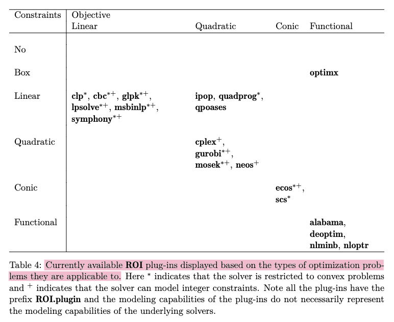

```{r setup, include=FALSE}
knitr::opts_chunk$set(echo = TRUE)
```


# Hierarchical time series

Create a hierarchical structure as complete as possible. Only nested structure is considered here. Then the summing matrix $\boldsymbol{S}$ is given and $\hat{\boldsymbol{y}}_h$ can be obtained easily by specifying forecasting models.

{width=20%}

For example,
$$
\boldsymbol{S}=\left[\begin{array}{llllll}
1 & 1 & 1 & 1 & 1 \\
1 & 1 & 1 & 0 & 0 \\
0 & 0 & 0 & 1 & 1 \\
1 & 0 & 0 & 0 & 0 \\
0 & 1 & 0 & 0 & 0 \\
0 & 0 & 1 & 0 & 0 \\
0 & 0 & 0 & 1 & 0 \\
0 & 0 & 0 & 0 & 1 \\
\end{array}\right], \text{ and } \hat{\boldsymbol{y}}_h = (10, 6, 5, 1, 4, 0, 2, 5)'.
$$


# Linear forecast reconciliation

$$
\tilde{\boldsymbol{y}}_h=\boldsymbol{S} \boldsymbol{G}_h \hat{\boldsymbol{y}}_h,
$$
where $\boldsymbol{G}_h$ maps the base forecasts $\hat{\boldsymbol{y}}_h$ into the bottom level, it combines all base forecasts to form bottom-level forecasts.

* **Bottom-up approach:** $\boldsymbol{G}_{bu}=\left[\begin{array}{ll} \boldsymbol{O}_{n_b \times n_a} & \boldsymbol{I}_{n_b}\end{array}\right]$

* **Top-down approach:** $\boldsymbol{G}_{td}=\left[\begin{array}{ll} \boldsymbol{p} & \boldsymbol{O}_{n_b \times (n-1)}\end{array}\right]$, where $\boldsymbol{p}$ is an $n_b$-dimensional vector including the set of disaggregation proportions.

* **Middle-out approach:** $\boldsymbol{G}_{mo}=\left[\begin{array}{lll} \boldsymbol{O}_{n_b \times n_t} & \boldsymbol{P}_{n_b \times n_l} & \boldsymbol{O}_{n_b \times n_d}\end{array}\right]$, where $n_t + n_l + n_d = n$, $n_d \geq n_b$, $n_t \geq 1$, $\sum_{i=1}^{n_b}\sum_{j=1}^{n_l}p_{ij} = n_l$.

* **Optimization approaches:** $\boldsymbol{G}_h = \left(\boldsymbol{S}^{\prime} \boldsymbol{W}_h^{-1} \boldsymbol{S}\right)^{-1} \boldsymbol{S}^{\prime} \boldsymbol{W}_h^{-1}$ is obtained by solving the optimization problem
$$
\min _{\boldsymbol{G}_h}\left(\hat{\boldsymbol{y}}_h-\boldsymbol{S} \boldsymbol{G}_h \hat{\boldsymbol{y}}_h\right)^{\prime} \boldsymbol{W}_h^{-1}\left(\hat{\boldsymbol{y}}_h-\boldsymbol{S} \boldsymbol{G}_h \hat{\boldsymbol{y}}_h\right), \text{ s.t. } \boldsymbol{G}_h \boldsymbol{S}=\boldsymbol{I}_{n_b}
$$


# Subset selection

a. About $\boldsymbol{G}_h$. Our goal is to **zero out some columns** so that the corresponding base forecasts in $\hat{\boldsymbol{y}}_h$ are not used to form the reconciled bottom-level forecasts and, furthermore, all reconciled forecasts.

b. About $\boldsymbol{S}$. It sums up the reconciled bottom-level forecasts to get the full set of reconciled forecasts. For the purpose of automatic selection and comparison, we don't need to zero out the corresponding rows.

We have to add additional constraints on $\boldsymbol{G}_h$. This leads to a main question:

*How to mathematically describe the constraint?*

## Ideas based on MinT

### Solution 1

$$
\tilde{\boldsymbol{y}}_h=\boldsymbol{S} \boldsymbol{G}_h \boldsymbol{B}_h \hat{\boldsymbol{y}}_h,
$$
where $\boldsymbol{B}_h$ is an $n \times n$ diagonal matrix with elements of the main diagonal being either zero or one.

The optimization problem can be written as
$$
\begin{array}{r}
\min_{\boldsymbol{G}_h}\left(\hat{\boldsymbol{y}}_h-\boldsymbol{S} \boldsymbol{G}_h \boldsymbol{B}_h \hat{\boldsymbol{y}}_h\right)^{\prime} \boldsymbol{W}_h^{-1}\left(\hat{\boldsymbol{y}}_h-\boldsymbol{S} \boldsymbol{G}_h \boldsymbol{B}_h \hat{\boldsymbol{y}}_h\right) + \lambda ||\boldsymbol{B}_h \boldsymbol{1}||_{1}, \\
\text{ s.t. } \boldsymbol{G}_h \boldsymbol{B}_h \boldsymbol{S} =\boldsymbol{I}_{n_b} \\
b_{ii}(1-b_{ii})=0 \text{ for } i =1,2,\ldots,n \\
b_{ij}=0 \text{ for } i \neq j
\end{array}
$$
The difficulty is that we wish to find the value of $\boldsymbol{G}_h$ and $\boldsymbol{B}_h$ simultaneously. 

### Solution 2

$$
\tilde{\boldsymbol{y}}_h=\boldsymbol{S} \check{\boldsymbol{G}}_h \check{\boldsymbol{B}}_h \hat{\boldsymbol{y}}_h,
$$
where $\check{\boldsymbol{G}}_h$ is given using ols, wls, structural scaling, or shrinkage estimator of $\boldsymbol{W}_h$. $\check{\boldsymbol{B}}_h$ is an $n \times n$ diagonal matrix with elements of the main diagonal being either greater than or equal to zero. So $\check{\boldsymbol{B}}_h$ can adaptively changes given $\check{\boldsymbol{G}}_h$ and we can only estimate $\check{\boldsymbol{B}}_h$. But the reconciled forecasts are likely to no longer preserve the unbiasedness.

The optimization problem can be written as
$$
\begin{array}{r}
\min _{\boldsymbol{G}_h}\left(\hat{\boldsymbol{y}}_h-\boldsymbol{S} \check{\boldsymbol{G}}_h \check{\boldsymbol{B}}_h \hat{\boldsymbol{y}}_h\right)^{\prime} \boldsymbol{W}_h^{-1}\left(\hat{\boldsymbol{y}}_h-\boldsymbol{S} \check{\boldsymbol{G}}_h \check{\boldsymbol{B}}_h \hat{\boldsymbol{y}}_h\right) + \lambda ||\check{\boldsymbol{B}}_h \boldsymbol{1}||_{1}, \\
\text{ s.t. } b_{ii} \geq 0 \text{ for } i = 1,\ldots,n\\
b_{ij}=0 \text{ for } i \neq j
\end{array}
$$

**R implementation**

```{r example1, message=FALSE, warning=FALSE}
library(CVXR)

y_hat <- c(10, 6, 5, 1, 4, 0, 2, 5)
S <- rbind(matrix(c(rep(1, 5), c(rep(1, 3), rep(0, 2)), c(rep(0, 3), rep(1, 2))), 
                  nrow = 3, byrow = TRUE),
           diag(1, nrow = 5))

W_inv <- solve(diag(c(5,3,2,1,1,1,1,1))) # structural scaling approximation
G <- solve(t(S) %*% W_inv %*% S) %*% t(S) %*% W_inv

b <- Variable(8)
lambda <- 0.3

e <- y_hat - S %*% G  %*% diag(b) %*% y_hat
obj <- quad_form(e, W_inv) + lambda * norm1(b)
prob <- Problem(Minimize(obj), constraints = list(b >= 0))
res <- solve(prob)
res$getValue(b)

(B_check <- diag(round(as.vector(res$getValue(b)), digits = 3)))

(y_tilde <- as.vector(S %*% G %*% B_check %*% y_hat))
```

### Solution 3

$$
\tilde{\boldsymbol{y}}_h=\boldsymbol{S} \boldsymbol{G}_h \hat{\boldsymbol{y}}_h
$$

According to [Miyashiro & Takano (2015)](https://doi.org/10.1016/j.eswa.2014.07.056), we can use mixed logical programming and rewrite the problem as
$$
\begin{array}{r}
\min _{\boldsymbol{G}_h}\left(\hat{\boldsymbol{y}}_h-\boldsymbol{S} \boldsymbol{G}_h \hat{\boldsymbol{y}}_h\right)^{\prime} \boldsymbol{W}_h^{-1}\left(\hat{\boldsymbol{y}}_h-\boldsymbol{S} \boldsymbol{G}_h \hat{\boldsymbol{y}}_h\right) + \lambda \sum_{j=1}^{n}b_j, \\
\text{ s.t. } \boldsymbol{G}_h \boldsymbol{S}=\boldsymbol{I}_{n_b} \\
b_j = 0 \Rightarrow ||\boldsymbol{G}_{\cdot j}||_{1}=0 \quad (j=1,2, \ldots, n)\\
b_j \in \{0,1\} \quad (j=1,2, \ldots, n)
\end{array}
$$

## Minimization problem

As already shown in [Ben Taieb & Koo (2019)](https://doi.org/10.1145/3292500.3330976),
$$
\begin{aligned}
& \mathrm{E}\left[\left\|\boldsymbol{y}_{T+h}-\tilde{\boldsymbol{y}}_{h}\right\|_2^2 \mid \boldsymbol{I}_T\right] \\
& =\left\|\boldsymbol{S G}\left(\mathrm{E}\left[\hat{\boldsymbol{y}}_{h} \mid \boldsymbol{I}_T\right]-\mathrm{E}\left[\boldsymbol{y}_{T+h} \mid \boldsymbol{I}_T\right]\right)+(\boldsymbol{S}-\boldsymbol{S G S}) \mathrm{E}\left[\boldsymbol{b}_{T+h} \mid \boldsymbol{I}_T\right]\right\|_2^2 \\
& +\operatorname{Tr}\left(\operatorname{Var}\left[\boldsymbol{y}_{T+h}-\tilde{\boldsymbol{y}}_{h} \mid \boldsymbol{I}_T\right]\right).
\end{aligned}
$$

Under **the unbiasedness conditions (both for base and reconciled forecasts)**, minimizing the above loss reduces to the following problem:
$$
\min _{\boldsymbol{G}_h \in \mathcal{G}} \operatorname{Tr}\left(\operatorname{Var}\left[\boldsymbol{y}_{T+h}-\tilde{\boldsymbol{y}}_{h} \mid \boldsymbol{I}_T\right]\right) \\
\text { s.t. } \boldsymbol{S G_{h} S}=\boldsymbol{S}.
$$

The trace minimization problem can be reformulated in terms of a linear equality constrained least squares problem as follows:
$$
\min _{\boldsymbol{G}_h}\left(\hat{\boldsymbol{y}}_h-\boldsymbol{S} \boldsymbol{G}_h \hat{\boldsymbol{y}}_h\right)^{\prime} \boldsymbol{W}_h^{-1}\left(\hat{\boldsymbol{y}}_h-\boldsymbol{S} \boldsymbol{G}_h \hat{\boldsymbol{y}}_h\right), \\
\text{ s.t. } \boldsymbol{G}_h \boldsymbol{S} =\boldsymbol{I}_{n_b}
$$

* The MinT optimization problem must impose **two unbiasedness conditions**.

* Such an assumption does not always hold in practice, especially when we aim to zero out some columns of $\boldsymbol{G}$.

* The out-of-sample forecasting accuracy of base forecasts is an important basis for determining which columns are zeroed out.

## Relaxation of the unbiasedness assumptions

[Ben Taieb & Koo (2019)](https://doi.org/10.1145/3292500.3330976) consider the empirical risk minimization (ERM) problem:
$$
\begin{aligned}
\hat{G}_{\text {ERMreg }}=&\underset{\boldsymbol{G} \in \mathcal{G}}{\operatorname{argmin}}\left\{\left\|\boldsymbol{Y}-\hat{\boldsymbol{Y}} \boldsymbol{G}^{\prime} \boldsymbol{S}^{\prime}\right\|_F^2 / N n+\lambda\|\operatorname{vec}(\boldsymbol{G})\|_1\right\},\\
=&\underset{\boldsymbol{G} \in \mathcal{G}}{\operatorname{argmin}}\left\{\left\|\operatorname{vec}(\boldsymbol{Y})-(\boldsymbol{S} \otimes \hat{\boldsymbol{Y}}) \operatorname{vec}\left(\boldsymbol{G}^{\prime}\right)\right\|_2^2 / N n+\lambda\|\operatorname{vec}(\boldsymbol{G})\|_1\right\}
\end{aligned}
$$
The problem can be reduced to **a standard LASSO problem** with $\operatorname{vec}(\boldsymbol{Y})$ as dependent variable and $(\boldsymbol{S} \otimes \hat{\boldsymbol{Y}})$ as design matrix. it is a LASSO problem with $N \times n$ observations and $m \times N$ variables.

## Ideas based on the assumption relaxation

### Optimization problem

**For our project...**

We aim to deal with the minimization problem

$$
\begin{aligned}
\hat{G}=&\underset{\boldsymbol{G} \in \mathcal{G}}{\operatorname{argmin}}\left\{\left\|\boldsymbol{Y}-\hat{\boldsymbol{Y}} \boldsymbol{G}^{\prime} \boldsymbol{S}^{\prime}\right\|_F^2 / N n+\lambda \sum_{j=1}^{n}z_{j} \right\},\\
=&\underset{\boldsymbol{G} \in \mathcal{G}}{\operatorname{argmin}}\left\{\left\|\operatorname{vec}(\boldsymbol{Y})-(\boldsymbol{S} \otimes \hat{\boldsymbol{Y}}) \operatorname{vec}\left(\boldsymbol{G}^{\prime}\right)\right\|_2^2 / N n+\lambda \sum_{j=1}^{n}z_{j} \right\} \\
s.t. & -M z_{j} \leq \sum_{i=0}^{m-1}|g_{j+in}| \leq M z_{j}  \text{ (Or quadratic form)}\\
& z_{j} \in \{0, 1\} \quad \text{ for } j=1,\ldots,n
\end{aligned}
$$

* Mixed integer programming (Do not have closed-form solution).

* The results are greatly influenced by the values of $M$ and $\lambda$.

* If we assume all elements of $\boldsymbol{G}$ are non-negative, it can be solved by CVXR package even if this is a non-convex problem.

```{r example2, message=FALSE, warning=FALSE}
library(CVXR)

set.seed(123)
S <- rbind(matrix(c(rep(1, 5), c(rep(1, 3), rep(0, 2)), c(rep(0, 3), rep(1, 2))), 
                  nrow = 3, byrow = TRUE),
           diag(1, nrow = 5))
B <- matrix(c(rnorm(10, 1, 1), 
              rnorm(10, 4, 1), 
              rnorm(10, 0, 1),
              rnorm(10, 2, 1),
              rnorm(10, 5, 1)), 
            byrow = FALSE, nrow = 10)
Y <- B %*% t(S)
Y_hat <- matrix(c(rnorm(10, 10, 1), 
                  rnorm(10, 6, 1), 
                  rnorm(10, 5, 1), 
                  rnorm(10, 1, 1), 
                  rnorm(10, 4, 1), 
                  rnorm(10, 0, 1),
                  rnorm(10, 2, 1),
                  rnorm(10, 5, 1)), 
                byrow = FALSE, nrow = 10)

VecY <- as.vector(Y)
D <- kronecker(S, Y_hat)

b <- Variable(8, boolean = TRUE)
#G_trs <- Variable(8, 5)
GB_trs <- Variable(40)

lambda <- 0.1
M <- 100

loss <- sum_squares(VecY - D %*% GB_trs)/(10*8)
penalty <- lambda * norm1(b)
constraints <- list(
  GB_trs >= 0,
  sum_entries(GB_trs[(0:4)*8 + 1]) >= - M*b[1],
  sum_entries(GB_trs[(0:4)*8 + 2]) >= - M*b[2],
  sum_entries(GB_trs[(0:4)*8 + 3]) >= - M*b[3],
  sum_entries(GB_trs[(0:4)*8 + 4]) >= - M*b[4],
  sum_entries(GB_trs[(0:4)*8 + 5]) >= - M*b[5],
  sum_entries(GB_trs[(0:4)*8 + 6]) >= - M*b[6],
  sum_entries(GB_trs[(0:4)*8 + 7]) >= - M*b[7],
  sum_entries(GB_trs[(0:4)*8 + 8]) >= - M*b[8],
  sum_entries(GB_trs[(0:4)*8 + 1]) <=  M*b[1],
  sum_entries(GB_trs[(0:4)*8 + 2]) <=  M*b[2],
  sum_entries(GB_trs[(0:4)*8 + 3]) <=  M*b[3],
  sum_entries(GB_trs[(0:4)*8 + 4]) <=  M*b[4],
  sum_entries(GB_trs[(0:4)*8 + 5]) <=  M*b[5],
  sum_entries(GB_trs[(0:4)*8 + 6]) <=  M*b[6],
  sum_entries(GB_trs[(0:4)*8 + 7]) <=  M*b[7],
  sum_entries(GB_trs[(0:4)*8 + 8]) <=  M*b[8]
)

prob <- Problem(Minimize(loss + penalty), constraints)
res <- solve(prob)
(res$getValue(b))
t(matrix(round(res$getValue(GB_trs), digits = 5), 8, 5, byrow = FALSE))
```

### Possible benchmark based on iterative process

$$
\begin{aligned}
\hat{G}=&\underset{\boldsymbol{G} \in \mathcal{G}}{\operatorname{argmin}}\left\{\left\|\boldsymbol{Y}-\hat{\boldsymbol{Y}} \boldsymbol{B}^{\prime} \boldsymbol{G}^{\prime} \boldsymbol{S}^{\prime}\right\|_F^2 / N n+\lambda \| B \|_1 \right\},\\
=&\underset{\boldsymbol{G} \in \mathcal{G}}{\operatorname{argmin}}\left\{\left\|\operatorname{vec}(\boldsymbol{Y})-(\boldsymbol{S} \otimes \hat{\boldsymbol{Y}}) \operatorname{vec}\left(\boldsymbol{B}^{\prime} \boldsymbol{G}^{\prime}\right)\right\|_2^2 / N n+\lambda \| B \|_1 \right\} \\
=&\underset{\boldsymbol{G} \in \mathcal{G}}{\operatorname{argmin}}\left\{\left\|\operatorname{vec}(\boldsymbol{Y})-(\boldsymbol{S} \otimes \hat{\boldsymbol{Y}})(\boldsymbol{G} \otimes \boldsymbol{I}_n) \operatorname{vec}\left(\boldsymbol{B}^{\prime}\right)\right\|_2^2 / N n+\lambda \| B \|_1 \right\} \\
= &\underset{\boldsymbol{G} \in \mathcal{G}}{\operatorname{argmin}}\left\{\left\|\operatorname{vec}(\boldsymbol{Y})-(\boldsymbol{S} \otimes \hat{\boldsymbol{Y}})(\boldsymbol{I}_n \otimes \boldsymbol{B}^{\prime}) \operatorname{vec}\left(\boldsymbol{G}^{\prime}\right)\right\|_2^2 / N n+\lambda \| B \|_1 \right\}\\
s.t. \quad  & b_{ii} \in \{0, 1\} \quad\text{ for } i=1,\ldots, n \\
& b_{ij} = 0 \quad\text{ for } i\ne j
\end{aligned}
$$

* Initial $\boldsymbol{G}^{0}$ $\Rightarrow$ $\boldsymbol{B}^{1}$ (Lasso problem) $\Rightarrow$ $\boldsymbol{G}^{1}$ (Analytical solution) $\Rightarrow$ $\ldots$

## ROI introduction

The R Optimization Infrastructure (ROI) package is an R **interface** which provides an extensible infrastructure to model linear, quadratic, conic and general nonlinear optimization problems in a consistent way.

ROI provides the modeling capabilities and manages the **plugins**, the plugins add the solvers to ROI.

**Optimization problem**

\begin{equation}
\label{eq:op}
\begin{aligned}
\text{ minimize } & f_0(x) \\
\text { s.t. } & f_i(x) \leq b_i, \quad i=1, \ldots, m
\end{aligned}
\end{equation}

1. Linear programming (LP)

    All $f_i$ $(i= 0, \ldots ,m)$ in Equation \ref{eq:op} are linear.
  
    **All LPs are convex.**

2. Quadratic programming (QP)

    The objective function $f_0$ contains a quadratic part in addition to the linear term. QPs can be expressed in the following manner:
$$
\begin{aligned}
\text { minimize } & \frac{1}{2} x^{\top} Q_0 x+a_0^{\top} x \\
\text { s.t. } & A x \leq b
\end{aligned}
$$
    **A QP is convex if and only if $Q_0$ is positive semidefinite.**
  
    A generalization of the QP is the quadratically constrained quadratic program (QCQP):
$$
\begin{aligned}
\text { minimize } & \frac{1}{2} x^{\top} Q_0 x+a_0^{\top} x \\
\text { s.t. } & \frac{1}{2} x^{\top} Q_i x+a_i^{\top} x \leq b_i, \quad i=1, \ldots, m
\end{aligned}
$$
    **A QCQP is convex if and only if all $Q_i(i=0, \ldots, m)$ are positive semidefinite.**
  
3. Conic programming (CP)

    **CP refers to a class of problems designed to model convex OPs.** A CP is commonly defined as:
$$
\begin{aligned}
\text { minimize } & a_0^{\top} x \\
\text { s.t. } & A x+s=b \\
& s \in \mathcal{K}
\end{aligned}
$$
    where $s$ is a slack variable that is added to an inequality constraint to transform it to an equality, and the set $\mathcal{K}$ is a nonempty closed convex cone.

    Nonlinear objective functions are expressed in epigraph form:
$$
\begin{aligned}
\text { minimize } & t \\
\text { s.t. } & f_0(x) \leq t \\
& f_i(x) \leq b_i
\end{aligned}
$$
    * Zero cone and free cone
    $$
    \mathcal{K}_{\text {zero }}=\{0\}, \mathcal{K}_{\text {free }}=\mathbb{R}=\mathcal{K}_{\text {zero }}^*.
    $$
    E.g., $s_i \in \mathcal{K}_{\text {zero }} \Longleftrightarrow s_i=b_i-a_i^{\top} x=0 \Longleftrightarrow a_i^{\top} x=b_i$.

    * Linear cone (non-negative orthant)
    $$
    \mathcal{K}_{\operatorname{lin}}=\{x \in \mathbb{R} \mid x \geq 0\} .
    $$
    E.g., $s_i \in \mathcal{K}_{\text {lin }} \Longleftrightarrow s_i=b_i-a_i^{\top} x \geq 0 \Longleftrightarrow a_i^{\top} x \leq b_i$.

    * Second-order cone
    $$
    \mathcal{K}_{\mathrm{soc}}^n=\left\{(t, x) \in \mathbb{R}^n \mid x \in \mathbb{R}^{n-1}, t \in \mathbb{R},\|x\|_2 \leq t\right\} .
    $$
    E.g., $s_i \in \mathcal{K}_{\mathrm{soc}}^n \Longleftrightarrow s_i=b_i-a_i^{\top} x \geq 0 \Longleftrightarrow a_i^{\top} x \leq b_i$.
    
    * ...

4. Nonlinear programming (NLP)
    
    At least one $f_i$, $i= 0, \ldots ,m$ in Equation \ref{eq:op} is not linear.
    
    NLPs are not required to be convex, which makes it in general hard to obtain a reliable global solution.

5. Mixed integer programming (MIP)
    
    Additional constraints: some of the objective variables can only take integer values.

{width=90%}

## Optimization problem solving

### Rewrite the optimization problem

Original problem:

\begin{equation}
\label{op_goal}
\begin{aligned}
&\underset{\boldsymbol{G}, \boldsymbol{z}}{\operatorname{argmin}}\left\{\left\|\boldsymbol{Y}-\hat{\boldsymbol{Y}} \boldsymbol{G}^{\prime} \boldsymbol{S}^{\prime}\right\|_F^2 / N n+\lambda \sum_{j=1}^{n}z_{j} \right\},\\
=&\underset{\boldsymbol{G}, \boldsymbol{z}}{\operatorname{argmin}}\left\{\left\|\operatorname{vec}(\boldsymbol{Y})-(\boldsymbol{S} \otimes \hat{\boldsymbol{Y}}) \operatorname{vec}\left(\boldsymbol{G}^{\prime}\right)\right\|_2^2 / N n+\lambda \sum_{j=1}^{n}z_{j} \right\} \\
s.t. & -M z_{j} \leq \sum_{i=0}^{m-1}|g_{j+in}| \leq M z_{j}  \text{ (Or quadratic form)}\\
& z_{j} \in \{0, 1\} \quad \text{ for } j=1,\ldots,n
\end{aligned}
\end{equation}

Rewrite the problem:

\begin{equation}
\label{op_rewrite}
\begin{aligned}
&\underset{\boldsymbol{G}, \boldsymbol{z}}{\operatorname{argmin}}\left\{\left\|\operatorname{vec}(\boldsymbol{Y})-(\boldsymbol{S} \otimes \hat{\boldsymbol{Y}}) \operatorname{vec}\left(\boldsymbol{G}^{\prime}\right)\right\|_2^2 / N n+\lambda \sum_{j=1}^{n}z_{j} \right\} \\
=&\underset{\boldsymbol{g}, \boldsymbol{z}}{\operatorname{argmin}}\left\{\left\|\boldsymbol{y}-\boldsymbol{X} \boldsymbol{g}\right\|_2^2 / N n+\lambda \boldsymbol{1}^{\prime}\boldsymbol{z} \right\} \\
=&\underset{\boldsymbol{g}, \boldsymbol{\gamma}, \boldsymbol{z}}{\operatorname{argmin}}\left\{\frac{1}{Nn}\boldsymbol{\gamma}^{\prime}\boldsymbol{\gamma}+\lambda \boldsymbol{1}^{\prime}\boldsymbol{z} \right\} \\
\text{ s.t. } & \boldsymbol{y}-\boldsymbol{X} \boldsymbol{g} = \boldsymbol{\gamma} \\
& \sum_{i=0}^{m-1}\left(g_{j+in}\right)^{2} \leq M z_{j} \quad \text{ for } j=1,\ldots,n \\
& \boldsymbol{z} \in \{0, 1\}^{n}
\end{aligned}
\end{equation}

### ROI code logic

QP with LC and QC:
$$
\begin{aligned}
\underset{\boldsymbol{\beta} = \left(\boldsymbol{g}_{mn}^{\prime}, \boldsymbol{\gamma}_{Nn}^{\prime}, \boldsymbol{z}_{n}^{\prime}\right)^{\prime}}{\operatorname{argmin}} & \frac{1}{2} \boldsymbol{\beta}^{\prime} \boldsymbol{Q}_0 \boldsymbol{\beta}+\boldsymbol{a}_0^{\prime} \boldsymbol{\beta} \\
\text { s.t. } & \boldsymbol{A}\boldsymbol{\beta} = \boldsymbol{y} \\
& \frac{1}{2} \boldsymbol{\beta}^{\prime} \boldsymbol{Q}_j \boldsymbol{\beta}+\boldsymbol{a}_j^{\prime} \boldsymbol{\beta} \leq b_j, \quad j=1, \ldots, n \\
& \boldsymbol{z} \in \{0, 1\}^{n}
\end{aligned}
$$

* $\boldsymbol{Q}_{0} = \begin{pmatrix}
\boldsymbol{O}_{mn} &                                 &                    \\
                    & \frac{2}{Nn}\boldsymbol{1}_{Nn} &                    \\
                    &                                 & \boldsymbol{O}_{n}  \\
\end{pmatrix}$
and
$\boldsymbol{a}_0 = (\boldsymbol{0}_{mn+Nn}^{\prime}, \lambda \boldsymbol{1}_{n}^{\prime})^{\prime}$.

* $\boldsymbol{A} = (\boldsymbol{X}_{Nn \times mn} | \boldsymbol{1}_{Nn} | \boldsymbol{O}_{Nn \times n})$.

* For $j = 1, \ldots, n$, 
    * $\boldsymbol{Q}_{j} = \begin{pmatrix}
2\boldsymbol{D}_{mn} &                      \\
                    & \boldsymbol{O}_{Nn+n} \\
\end{pmatrix}$ with $d_{j+i \times n, j+i \times n} = 1$ $(i = 0, \ldots, m-1)$ and other elements are zeros. 
    * $\boldsymbol{a}_{j} = (\boldsymbol{0}_{mn+Nn}^{\prime}, -M\boldsymbol{d}_{n}^{\prime})^{\prime}$ with $d_{j} = 1$ and other elements are zeros.

### ROI implementation

```{r roi, message=FALSE, warning=FALSE}
Sys.setenv(ROI_LOAD_PLUGINS = "FALSE")
library(ROI)
library(slam)
library(magrittr)
library(ROI.plugin.neos)
library(ROI.plugin.gurobi)

dbind <- function(...) {
  ## sparse matrices construction
  .dbind <- function(x, y) {
    A <- simple_triplet_zero_matrix(NROW(x), NCOL(y))
    B <- simple_triplet_zero_matrix(NROW(y), NCOL(x))
    rbind(cbind(x, A), cbind(B, y))
  }
  Reduce(.dbind, list(...))
}

# Example data
set.seed(123)
S <- rbind(matrix(c(rep(1, 5), c(rep(1, 3), rep(0, 2)), c(rep(0, 3), rep(1, 2))), 
                  nrow = 3, byrow = TRUE),
           diag(1, nrow = 5))
B <- matrix(c(rnorm(10, 1, 1), 
              rnorm(10, 4, 1), 
              rnorm(10, 0, 1),
              rnorm(10, 2, 1),
              rnorm(10, 5, 1)), 
            byrow = FALSE, nrow = 10)
Y <- B %*% t(S)
Y_hat <- matrix(c(rnorm(10, 10, 1), 
                  rnorm(10, 6, 1), 
                  rnorm(10, 5, 1), 
                  rnorm(10, 1, 1), 
                  rnorm(10, 4, 1), 
                  rnorm(10, 0, 1),
                  rnorm(10, 2, 1),
                  rnorm(10, 5, 1)), 
                byrow = FALSE, nrow = 10)
VecY <- as.vector(Y)
D <- kronecker(S, Y_hat)

# Quadratic optimization problem
gp_op <- function(x, y, n, m, lambda, M) {
  ## x: kronecker(S, Y_hat)
  ## y: vec(Y)
  ## lambda: Lagrange multiplier
  ## n: number of all series
  ## m: number of bottom-level series
  ## M: big-M
  stzm <- simple_triplet_zero_matrix
  stdm <- simple_triplet_diag_matrix
  
  Nn <- NROW(x); mn <- NCOL(x)
  Q0 <- dbind(stzm(mn), stdm(2/Nn, Nn), stzm(n))
  a0 <- c(g = double(mn), ga = double(Nn), z = lambda * rep(1, n))
  op <- OP(objective = Q_objective(Q = Q0, L = a0))
  
  ## y - X %*% g = gamma  <=>  X %*% g + gamma = y
  A1 <- cbind(x, stdm(1, Nn), stzm(Nn, n))
  LC1 <- L_constraint(A1, eq(Nn), y)
  ## \sum_{i=0}^{m-1} (g_{j+in})^2 - M z_j <= 0 for j = 1,...,n
  QNULL <- diag(0, mn + Nn + n)
  LNULL <- c(double(mn), double(Nn), double(n))
  Q <- lapply(1:n, function(j){
    i <- 0:(m - 1)
    Q_j <- QNULL
    diag(Q_j)[j + i*n] <- 2
    Q_j
  })
  L <- sapply(1:n, function(j){
    L_j <- LNULL
    L_j[mn + Nn + j] <- -M
    L_j
  }) %>% t()
  QC1 <- Q_constraint(Q = Q,
                      L = L,
                      dir = rep("<=", n),
                      rhs = rep(0, n))
  
  constraints(op) <- rbind(LC1, QC1)
  bounds(op) <- V_bound(li = 1:(mn + Nn), lb = rep.int(-Inf, mn + Nn), nobj = mn + Nn + n)
  types(op) <- c(rep("C", mn + Nn), rep("B", n))
  op
}
op <- gp_op(x = D, y = VecY, n = NROW(S), m = NCOL(S), lambda = 0.1, M = 100)

# Optimal solution - solver = "neos"
job_neos <- ROI_solve(op, "neos", email = "xiaoqian.wang@monash.edu")
## str(job_neos)
slt_neos <- solution(job_neos)
(z <- tail(slt_neos, NROW(S)))
(G_neos <- matrix(slt_neos[1:(NCOL(S)*NROW(S))], 
                  nrow = NROW(S), ncol = NCOL(S), byrow = FALSE) %>% 
  t() %>% 
  round(digits = 3))

# Optimal solution - solver = "gurobi"
job_gurobi <- ROI_solve(op, "gurobi")
 ## Register a Gurobi account as an academic user, request for a license, and download the current version of Gurobi optimizer
## str(job_gurobi)
slt_gurobi <- solution(job_gurobi)
(z <- tail(slt_gurobi, NROW(S)))
(G_gurobi <- matrix(slt_gurobi[1:(NCOL(S)*NROW(S))], 
                    nrow = NROW(S), ncol = NCOL(S), byrow = FALSE) %>% 
    t() %>% 
    round(digits = 3))
```

## Hyperparameters

### $\lambda$

We can use cross-validation to select the best value of $\lambda$, as implemented in the glmnet package in R.

The glmnet package computes the solutions for **a decreasing sequence of values for $\lambda$**, starting at the smallest value $\lambda_{\max }$ for which the entire vector $\hat{\beta}=0$. And then it selects a minimum value $\lambda_{\min }=\epsilon \lambda_{\max }$, and construct a sequence of $K$ values of $\lambda$ decreasing from $\lambda_{\max }$ to $\lambda_{\min }$ on the log scale. Typical values are $\epsilon=0.001$ and $K=100$.

## Simulations

* Simulation setups


# Other issues

## Temporal reconciliation

* Remove all nodes in a level or several levels.

## Non-negative constraints


